# Ticketing Backend — A Short Course

Welcome. This README is written like a **mini-course**: read it top to bottom once and you should understand what this repo does, how it is built, and how the pieces connect.

> **In one sentence:** A Spring Boot API that lets Peya users create events, sell tickets via wallet, and scan QR codes at the gate — with Oracle for data and Peya HTTP for identity.

---

## Table of contents

1. [What problem does this solve?](#1-what-problem-does-this-solve)
2. [Who talks to this API?](#2-who-talks-to-this-api)
3. [Big picture — system diagram](#3-big-picture--system-diagram)
4. [How the code is layered](#4-how-the-code-is-layered)
5. [Identity — no local user table](#5-identity--no-local-user-table)
6. [The data model](#6-the-data-model)
7. [Event ticket lifecycle](#7-event-ticket-lifecycle)
8. [Standalone tickets (bus, pass, etc.)](#8-standalone-tickets-bus-pass-etc)
9. [QR codes — Flutter builds, server validates](#9-qr-codes--flutter-builds-server-validates)
10. [Payments](#10-payments)
11. [API conventions](#11-api-conventions)
12. [Run it locally in 5 minutes](#12-run-it-locally-in-5-minutes)
13. [Configuration profiles](#13-configuration-profiles)
14. [Codebase map](#14-codebase-map)
15. [Go deeper](#15-go-deeper)

---

## 1. What problem does this solve?

Organizers need to:

- Create an event (concert, match, conference…)
- Generate a batch of tickets with unique codes
- Publish the event so buyers can see it
- Collect payment through **Peya wallet**
- Scan tickets at the entrance and mark them as used

Conductors and other operators also need **non-event tickets** (bus ride, day pass) without linking to an event.

This backend handles all of that. It does **not** ship a mobile UI — Flutter / web apps call the REST API.

---

## 2. Who talks to this API?

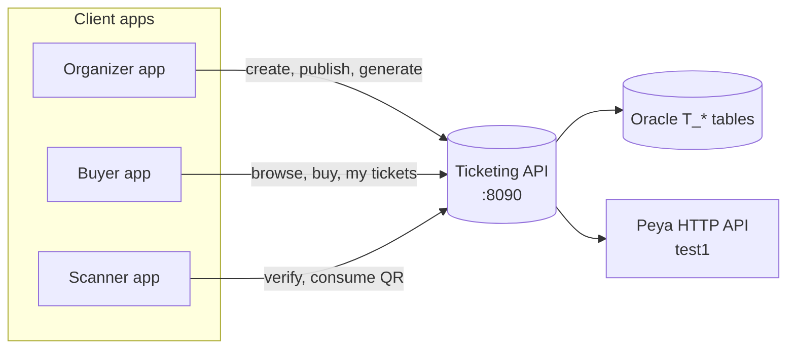

| Actor | Typical actions |
|-------|-------------------|
| **Organizer** | `events/create`, `tickets/generate`, `events/publish`, dashboard |
| **Buyer** | `events/public`, `tickets/buy`, `tickets/my` |
| **Scanner** | `tickets/verify`, `tickets/consume` |
| **Any app** | `clients/get` to resolve a Peya `codeClient` |

---

## 3. Big picture — system diagram

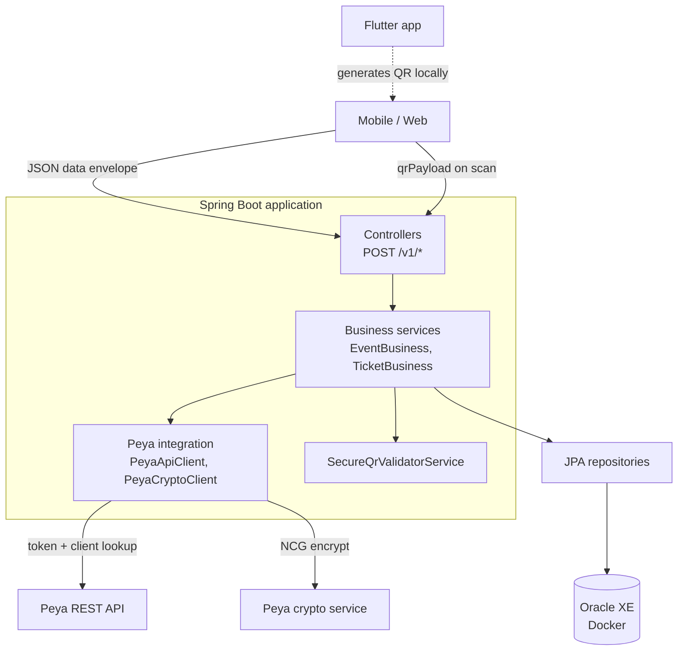

**Three external systems matter:**

| System | Role |
|--------|------|
| **Oracle** | Stores events, tickets, orders, audit log |
| **Peya HTTP** | Resolves `codeClient` → name, phone, account |
| **Flutter SecureQR** | Builds encrypted ticket QR; server only **validates** |

---

## 4. How the code is layered

Every request follows the same path:

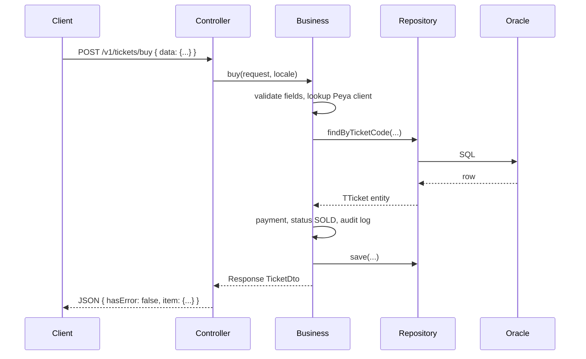

| Layer | Package / folder | Responsibility |
|-------|------------------|----------------|
| **Controller** | `controller/` | HTTP mapping, Swagger annotations |
| **Business** | `service/` | Rules, orchestration, transactions |
| **Repository** | `repository/` | Spring Data JPA → Oracle |
| **Entity** | `entity/` | `TEvent`, `TTicket`, `TOrder`, … |
| **DTO** | `dto/` | API request/response shapes |
| **Integration** | `integration/peya/` | HTTP + crypto calls to Peya |
| **Config** | `config/` | Swagger, security, `.env` loader |

**Design choice:** Business logic lives in `*Business` classes, not in controllers. Controllers stay thin.

---

## 5. Identity — no local user table

There is **no signup / login** in this repo.

Every request that needs a person sends a Peya **`codeClient`** in the JSON body. The server calls Peya (or a local `W_CLIENTS` fallback) to confirm the client exists and get their name.

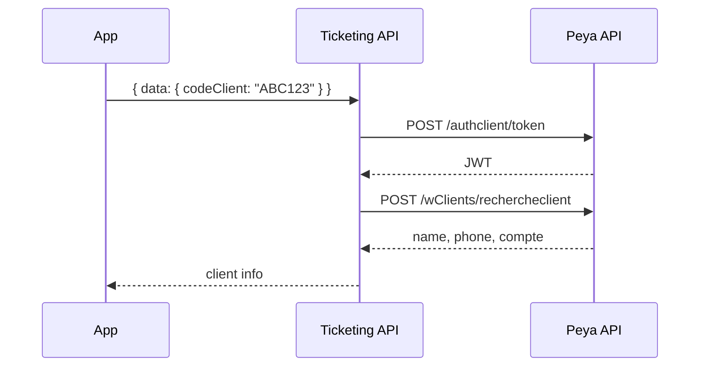

| Concept | Detail |
|---------|--------|
| Public IDs in API | `eventCode`, `ticketCode` (human-friendly, not UUID) |
| Internal IDs | UUID in `ID` columns (never exposed in API) |
| Trust model today | `codeClient` in body is trusted — production should add Peya JWT validation |

---

## 6. The data model

Four main tables. Think of them as **event → tickets → orders → audit trail**.

```mermaid
erDiagram
    T_EVENT ||--o{ T_TICKET : "has"
    T_TICKET ||--o| T_ORDER : "paid via"
    T_TICKET ||--o{ T_TICKET_AUDIT_LOG : "logged"

    T_EVENT {
        string EVENT_CODE UK
        string STATUS
        number TICKET_PRICE
        number MAX_TICKETS
    }

    T_TICKET {
        string TICKET_CODE UK
        string PURPOSE
        string STATUS
        string EVENT_CODE FK_optional
    }

    T_ORDER {
        string ORDER_REF UK
        string PAYMENT_STATUS
        number AMOUNT
    }
```

### Event status machine

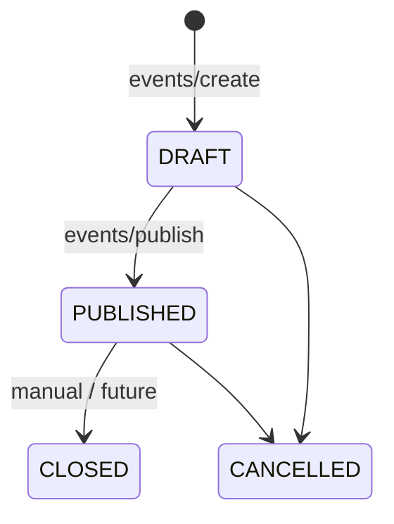

### Ticket status machine

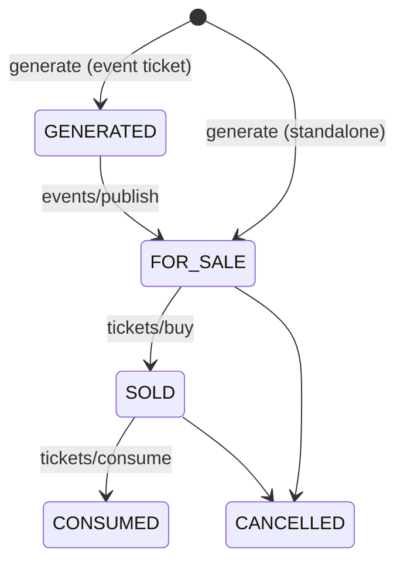

| `PURPOSE` | Meaning | `EVENT_ID` |
|-----------|---------|------------|
| `EVENT` | Linked to a concert, match, etc. | required |
| `TRANSPORT` | Bus, train, conductor ticket | null |
| `PASS` | Day / week pass | null |
| `GENERIC` | Anything else | null |

---

## 7. Event ticket lifecycle

This is the **happy path** for a concert. Numbers match the sequence.

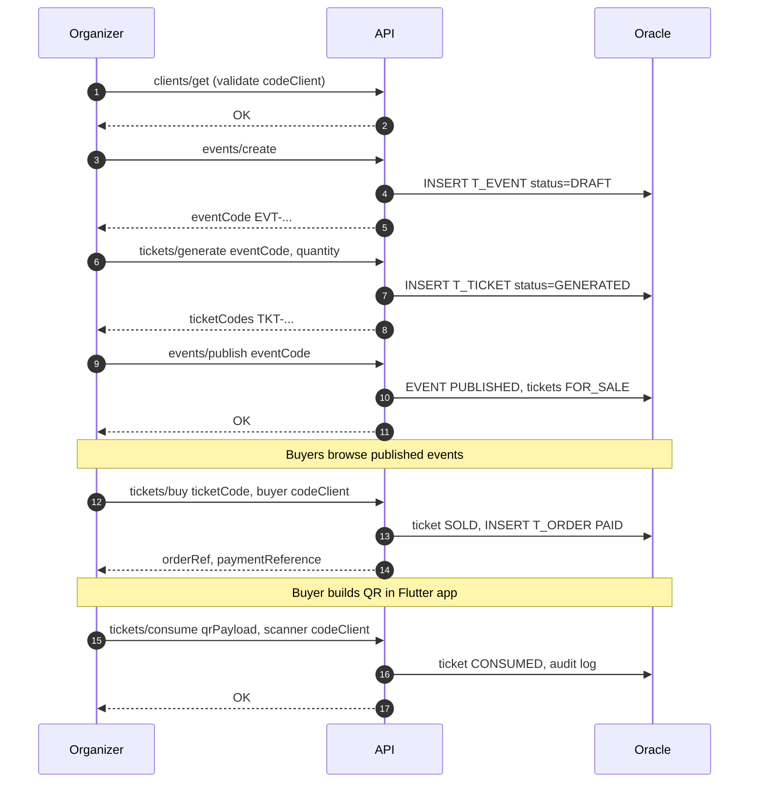

**Quick reference — endpoint order:**

```
1. POST /v1/clients/get
2. POST /v1/events/create          → DRAFT
3. POST /v1/tickets/generate       → GENERATED
4. POST /v1/events/publish         → PUBLISHED + FOR_SALE
5. POST /v1/events/public          → buyers browse
6. POST /v1/tickets/buy            → SOLD
7. POST /v1/tickets/verify         → optional gate check
8. POST /v1/tickets/consume        → CONSUMED
```

---

## 8. Standalone tickets (bus, pass, etc.)

No event needed. One call creates sellable tickets.

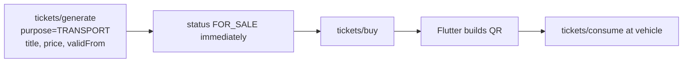

```json
{
  "data": {
    "codeClient": "CONDUCTOR_CODE",
    "purpose": "TRANSPORT",
    "title": "Abidjan → Bouaké",
    "place": "Gare routière",
    "validFrom": "2026-06-29T06:00:00",
    "price": 2500,
    "quantity": 50,
    "ticketType": "BUS"
  }
}
```

---

## 9. QR codes — Flutter builds, server validates

**Important:** The server does **not** generate the QR image or the encrypted payload for new tickets. The mobile app does, using the same `SecureQRGenerator` as Mon peya / `GENERATEUR_CODE_QR`.

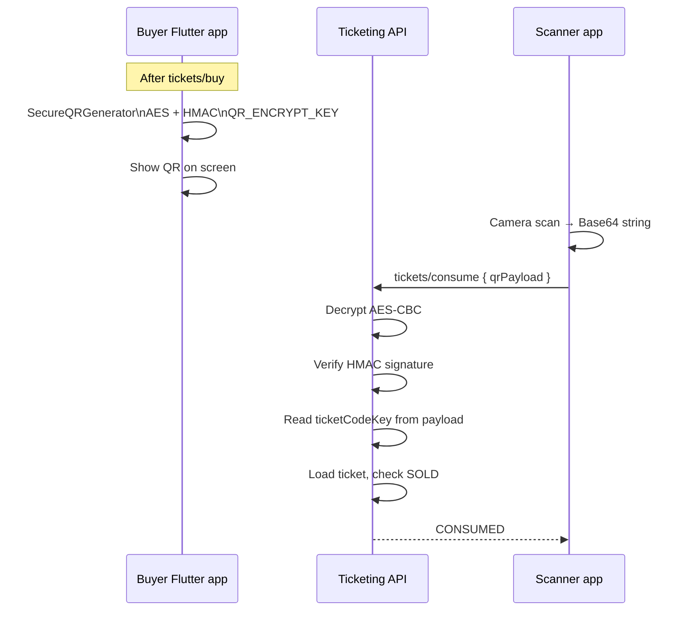

| Step | Where | Detail |
|------|-------|--------|
| Generate | **Flutter** | `QRData(payload: { ticketCodeKey, eventCodeKey, purposeKey, … })` |
| Encrypt | **Flutter** | `Base64(IV + AES-CBC ciphertext)`, key = `QR_ENCRYPT_KEY.padRight(32)` |
| Sign | **Flutter** | HMAC-SHA256 on JSON without `signature` field |
| Validate | **Server** | `SecureQrValidatorService` — same crypto rules |
| Legacy | **Server** | Old `TKT\|code\|context\|hmac` format still accepted |

Secret lives in `.env`:

```
QR_ENCRYPT_KEY=...   # same value as Mon peya / Flutter .env
```

Full payload contract: [docs/API.md — QR codes](docs/API.md).

---

## 10. Payments

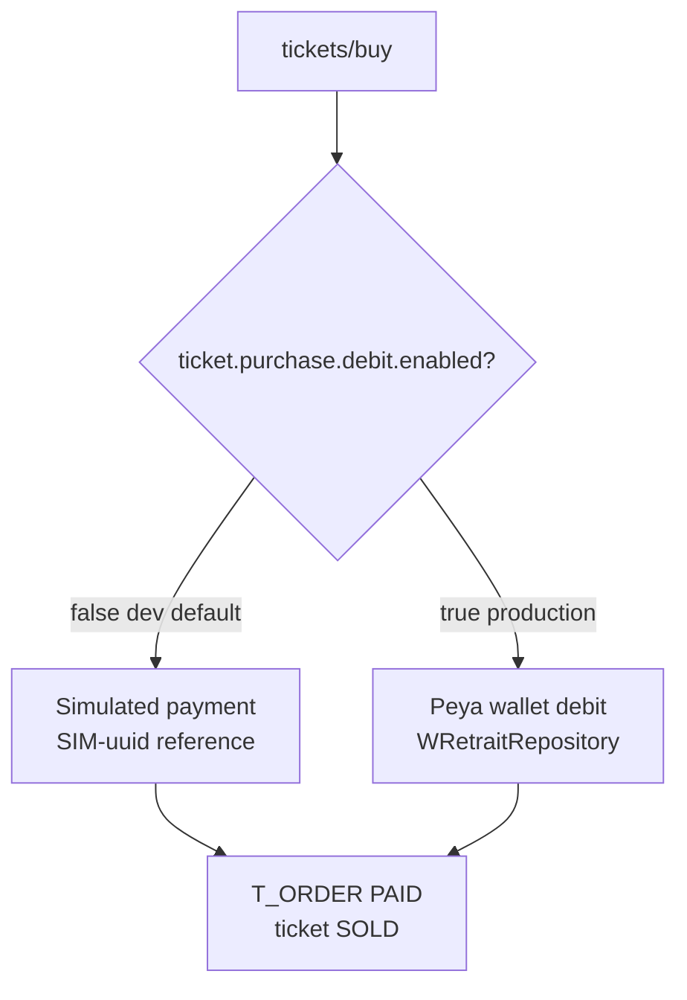

| Mode | Property | Behaviour |
|------|----------|-----------|
| **Dev (default)** | `TICKET_PURCHASE_DEBIT_ENABLED=false` | Fake `paymentReference`, no real money |
| **Production** | `TICKET_PURCHASE_DEBIT_ENABLED=true` | Debit buyer Peya account |

---

## 11. API conventions

All endpoints share one style (Mon peya pattern):

| Rule | Value |
|------|-------|
| Method | Always **POST** |
| Body | `{ "data": { ...fields } }` |
| Success | `hasError: false`, result in `item` or `items` + `count` |
| Errors | `hasError: true`, `status.code` + `status.message` |
| IDs in API | `eventCode`, `ticketCode` — not internal UUID |

**Example — health check:**

```bash
curl -X POST http://localhost:8090/v1/ping \
  -H "Content-Type: application/json" \
  -d "{\"data\":{}}"
```

**Example — buy a ticket:**

```json
{
  "data": {
    "ticketCode": "TKT-A1B2C3D4",
    "codeClient": "BUYER_PEYA_CODE",
    "paymentMethod": "PEYA_WALLET"
  }
}
```

Interactive explorer: **http://localhost:8090/swagger-ui.html**

---

## 12. Run it locally in 5 minutes

### Step 1 — Environment

```bash
cd ticketing
cp .env.example .env          # Windows: copy .env.example .env
```

Edit `.env`: set `PEYA_APP_ADMIN_USERNAME` / `PASSWORD` if using the `peya` profile. Set `QR_ENCRYPT_KEY` to match your Flutter app.

### Step 2 — Start

```bash
./mvnw spring-boot:run -Dspring-boot.run.profiles=peya
```

Windows:

```powershell
.\mvnw.cmd spring-boot:run "-Dspring-boot.run.profiles=peya"
```

What happens:

1. Docker Compose starts **Oracle XE** (first run: wait 2–3 min)
2. SQL init scripts create `T_*` tables
3. API listens on **http://localhost:8090**

### Step 3 — Verify

| Check | URL / command |
|-------|---------------|
| Health | `POST /v1/ping` |
| Swagger | http://localhost:8090/swagger-ui.html |
| DB | DBeaver → `localhost:1521` / `XEPDB1` / `ticketing` / `ticketing` |

### Common issues

| Symptom | Fix |
|---------|-----|
| `ORA-00942` table missing | `docker compose down -v` then restart, or apply `docker/oracle/init/*.sql` |
| `Le code client est inconnu` | Use `peya` profile + valid Peya `codeClient` |
| Oracle not ready | `docker compose ps` — wait for healthy |

More detail: [SETUP.md](SETUP.md)

---

## 13. Configuration profiles

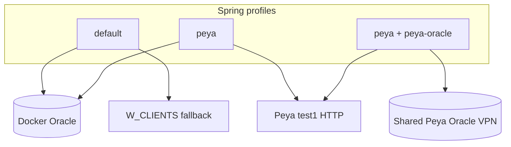

| Profile | Command | Database | Client lookup |
|---------|---------|----------|---------------|
| **default** | `mvnw spring-boot:run` | Docker Oracle | Local `W_CLIENTS` |
| **peya** *(recommended)* | `…profiles=peya` | Docker Oracle | Peya HTTP API |
| **peya-oracle** | `…profiles=peya,peya-oracle` | Remote Oracle | Peya HTTP API |

Secrets and toggles live in **`.env`** (loaded by `DotenvLoader` before Spring starts). Never commit `.env`.

---

## 14. Codebase map

```
ticketing/
├── .env.example              ← copy to .env (secrets, keys, toggles)
├── compose.yaml              ← Oracle XE container
├── docker/oracle/init/       ← DDL run on first DB start
│   ├── 02-ticketing-schema.sql
│   └── 04-generic-tickets-and-codes.sql
├── docs/
│   └── API.md                ← full endpoint reference
├── SETUP.md                  ← extended install / troubleshooting
└── src/main/java/.../api/
    ├── Application.java
    ├── config/
    │   ├── DotenvLoader.java      ← loads .env
    │   └── OpenApiConfig.java     ← Swagger
    ├── controller/
    │   ├── EventController.java
    │   ├── TicketController.java
    │   ├── ClientController.java
    │   └── DashboardController.java
    ├── service/
    │   ├── EventBusiness.java     ← event rules
    │   ├── TicketBusiness.java    ← ticket buy / verify / consume
    │   ├── ClientLookupService.java
    │   ├── TicketPaymentService.java
    │   └── qr/
    │       └── SecureQrValidatorService.java  ← Flutter QR validation
    ├── integration/peya/
    │   ├── PeyaApiClient.java
    │   └── PeyaCryptoClient.java
    ├── entity/                    ← JPA ↔ T_* tables
    └── repository/
```

**Read next when debugging:**

| Question | Start here |
|----------|--------------|
| Why did buy fail? | `TicketBusiness.buy()` |
| QR rejected? | `SecureQrValidatorService.validate()` |
| Client not found? | `ClientLookupService` + `peya.api.enabled` |
| Event won't publish? | `EventBusiness.publish()` |

---

## 15. Go deeper

| Resource | Content |
|----------|---------|
| [docs/API.md](docs/API.md) | Every endpoint, field, example, QR contract |
| [SETUP.md](SETUP.md) | Docker, profiles, schema reset, DBeaver |
| [Swagger UI](http://localhost:8090/swagger-ui.html) | Try endpoints live (app must be running) |
| `GENERATEUR_CODE_QR` repo | Flutter `SecureQRGenerator` source |

### Tech stack

Java 17 · Spring Boot 4.1 · Spring Data JPA · Oracle XE (Docker) · H2 (tests) · springdoc OpenAPI · Lombok · Peya REST + NCG crypto

---

## License

Proprietary — Djogana.
