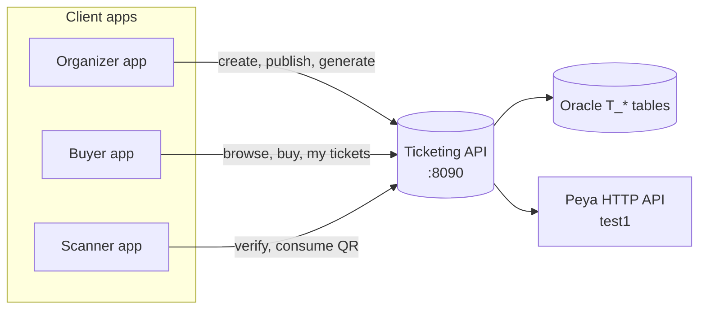
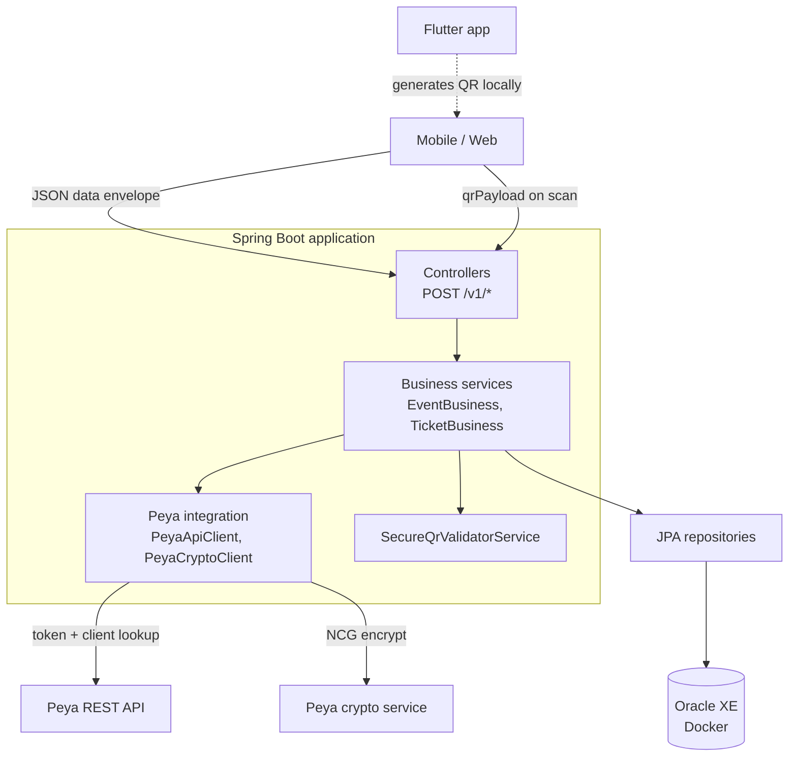

# Ticketing Backend — A Short Course

Welcome. This README is written like a **mini-course**: read it top to bottom once and you should understand what this repo does, how it is built, and how the pieces connect.

> **In one sentence:** A Spring Boot API that lets Peya users create events, sell tickets via wallet, and scan QR codes at the gate — with Oracle for data and Peya HTTP for identity.

---

## Table of contents

1. [What problem does this solve?](#1-what-problem-does-this-solve)
2. [Who talks to this API?](#2-who-talks-to-this-api)
3. [Big picture — system diagram](#3-big-picture--system-diagram)
4. [How the code is layered](#4-how-the-code-is-layered)
5. [Identity — no local user table](#5-identity--no-local-user-table)
6. [The data model](#6-the-data-model)
7. [Event ticket lifecycle](#7-event-ticket-lifecycle)
8. [Standalone tickets (bus, pass, etc.)](#8-standalone-tickets-bus-pass-etc)
9. [QR codes — Flutter builds, server validates](#9-qr-codes--flutter-builds-server-validates)
10. [Payments](#10-payments)
11. [API conventions](#11-api-conventions)
12. [Run it locally in 5 minutes](#12-run-it-locally-in-5-minutes)
13. [Configuration profiles](#13-configuration-profiles)
14. [Codebase map](#14-codebase-map)
15. [Go deeper](#15-go-deeper)

---

## 1. What problem does this solve?

Organizers need to:

- Create an event (concert, match, conference…)
- Generate a batch of tickets with unique codes
- Publish the event so buyers can see it
- Collect payment through **Peya wallet**
- Scan tickets at the entrance and mark them as used

Conductors and other operators also need **non-event tickets** (bus ride, day pass) without linking to an event.

This backend handles all of that. It does **not** ship a mobile UI — Flutter / web apps call the REST API.

---

## 2. Who talks to this API?



| Actor | Typical actions |
|-------|-------------------|
| **Organizer** | `events/create`, `tickets/generate`, `events/publish`, dashboard |
| **Buyer** | `events/public`, `tickets/buy`, `tickets/my` |
| **Scanner** | `tickets/verify`, `tickets/consume` |
| **Any app** | `clients/get` to resolve a Peya `codeClient` |

---

## 3. Big picture — system diagram



**Three external systems matter:**

| System | Role |
|--------|------|
| **Oracle** | Stores events, tickets, orders, audit log |
| **Peya HTTP** | Resolves `codeClient` → name, phone, account |
| **Flutter SecureQR** | Builds encrypted ticket QR; server only **validates** |

---

## 12. Run it locally in 5 minutes

### Step 1 — Environment

```bash
cd backend/ticketing
cp .env.example .env
```

Edit `.env`: set `PEYA_APP_ADMIN_USERNAME` / `PASSWORD` if using the `peya` profile. Set `QR_ENCRYPT_KEY` to match your Flutter app.

### Step 2 — Start

```bash
./mvnw spring-boot:run -Dspring-boot.run.profiles=peya
```

Windows:

```powershell
.\mvnw.cmd spring-boot:run "-Dspring-boot.run.profiles=peya"
```

What happens:

1. Docker Compose starts **Oracle XE** (first run: wait 2–3 min)
2. SQL init scripts create `T_*` tables
3. API listens on **http://localhost:8090**

### Step 3 — Verify

| Check | URL / command |
|-------|---------------|
| Health | `POST /v1/ping` |
| Swagger | http://localhost:8090/swagger-ui.html |
| DB | DBeaver → `localhost:1521` / `XEPDB1` / `ticketing` / `ticketing` |

More detail: [SETUP.md](SETUP.md)

---

## 14. Codebase map

```
backend/ticketing/
├── .env.example              ← copy to .env (secrets, keys, toggles)
├── compose.yaml              ← Oracle XE container
├── docker/oracle/init/       ← DDL run on first DB start
├── docs/
│   └── API.md                ← full endpoint reference
├── SETUP.md                  ← extended install / troubleshooting
└── src/main/java/.../api/
    ├── Application.java
    ├── controller/
    ├── service/
    ├── integration/peya/
    ├── entity/
    └── repository/
```

---

## 15. Go deeper

| Resource | Content |
|----------|---------|
| [docs/API.md](docs/API.md) | Every endpoint, field, example, QR contract |
| [SETUP.md](SETUP.md) | Docker, profiles, schema reset, DBeaver |
| [Swagger UI](http://localhost:8090/swagger-ui.html) | Try endpoints live (app must be running) |

### Tech stack

Java 17 · Spring Boot 4.1 · Spring Data JPA · Oracle XE (Docker) · H2 (tests) · springdoc OpenAPI · Lombok · Peya REST + NCG crypto

---

## License

Proprietary — Djogana.
